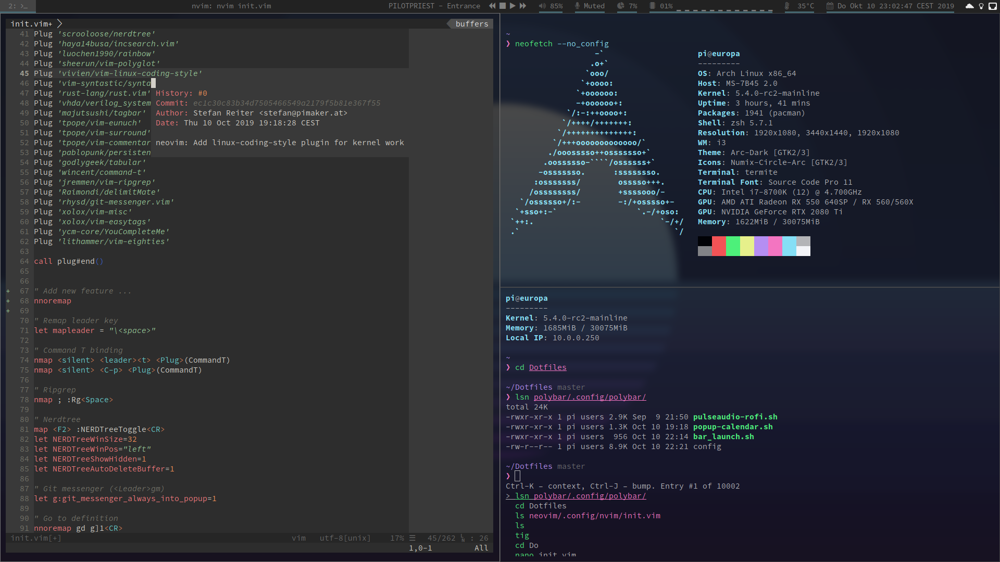

# Dotfiles

Collection of my most private parts... err, Linux dotfiles anyway.

You know why you're here, get inspired (or Ctrl-C/Ctrl-V-ing)!

## Screenshot

## Stow

Dotfiles are managed using Stow, but you can also just look at the Makefile to see how everything works.
